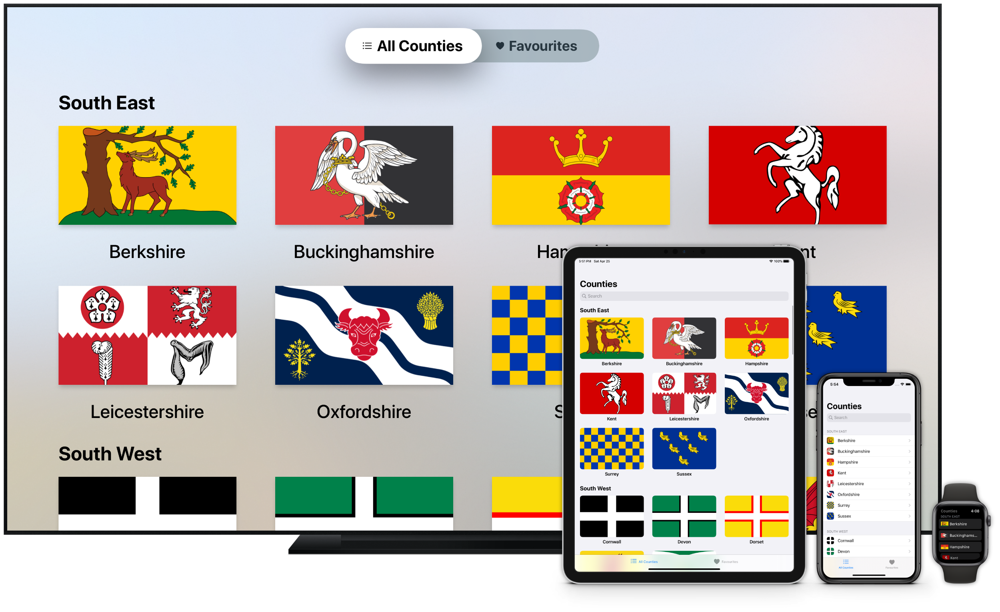
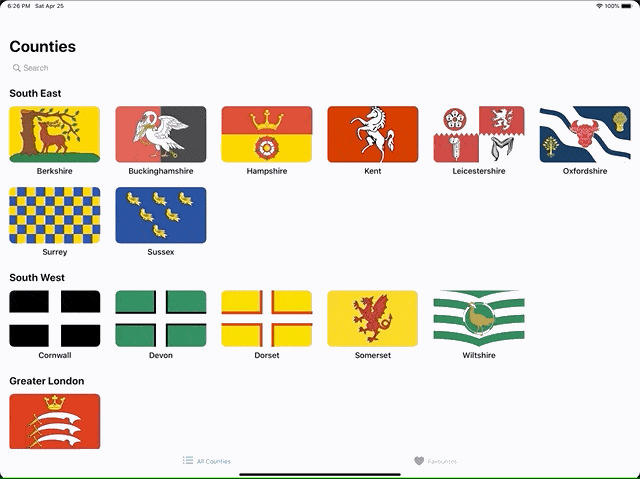

# Counties Sample App

The Counties sample app is the host for iOS, Apple Watch, and tvOS tutorials hosted on [darjeelingsteve.com](https://darjeelingsteve.com). The areas of development covered are as follows:

## [Advanced Multi-window UIs on iPadOS with Drag & Drop and State Restoration](https://darjeelingsteve.com/articles/Advanced-Multi-window-UIs-on-iPadOS-with-Drag-and-Drop-and-State-Restoration.html)

Support for advanced multi-window user interfaces on iPadOS.

## [Adaptive User Interfaces with UIStackView and UICollectionView](https://darjeelingsteve.com/articles/Adaptive-User-Interfaces-with-UIStackView-and-UICollectionView.html)

This tutorial demontrates how to create user interfaces that adapt between different user interface environments using modern APIs.

## [Continuity for Apple Watch and iPhone with Handoff](https://darjeelingsteve.com/articles/Continuity-for-Apple-Watch-and-iPhone-with-Handoff.html)

Allowing Handoff of tasks from Apple Watch to iPhone is detailed in this post.

## [Continuity for iPhone and iPad with Handoff](https://darjeelingsteve.com/articles/Continuity-for-iPhone-and-iPad-with-Handoff.html)

Adding Handoff from iPhone to iPad, and vica versa. This is very simple once Handoff from Aple Watch to iPhone has been implemented.

## [Indexing App Content with Core Spotlight](https://darjeelingsteve.com/articles/Indexing-App-Content-with-Core-Spotlight.html)

Here we detail how to add an application's data set to the on-device Spotlight Search index to allow the user to search the app's content from the iOS system search UI.

## [Simplifying UICollectionView Usage With UICollectionViewDiffableDataSource](https://darjeelingsteve.com/articles/Simplifying-UICollectionView-Usage-With-UICollectionViewDiffableDataSource.html)

Both `UICollectionView` and `UITableView` received significant updates at WWDC 2019, one of which was a new way to supply said views with the data that they display. This article goes in to the detail of refactoring a view controller conforming to `UICollectionViewDataSource` to using a `UICollectionViewDiffableDataSource` instead.

## [Spotlight Search Enhancements in iOS 10](https://darjeelingsteve.com/articles/Spotlight-Search-Enhancements-in-iOS-10.html)

This tutorial details the process of allowing your app to continue Spotlight searches that the user initiates in the system search UI. This involves directly querying the Spotlight index, something which only became possible in iOS 10.

## [Supporting 3D Touch “Peek and Pop”](https://darjeelingsteve.com/articles/Supporting-3D-Touch-%22Peek-and-Pop%22.html)

Here we learn how to add 3D Touch Peek and Pop navigation to the app. As well as the navigation, we also see how to add shortcut action items for the "Peek" stage of the navigation.

## [Supporting 3D Touch Application Shortcuts](https://darjeelingsteve.com/articles/Supporting-3D-Touch-Application-Shortcuts.html)

Adding 3D Touch Application Shortcuts is easy, as we see in this tutorial.
